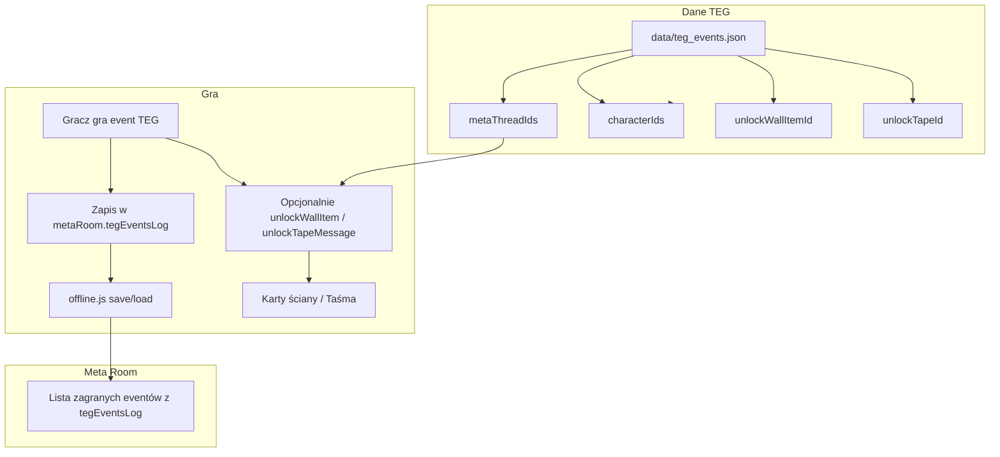

# TEG: siatka powiązań z postaciami/systemami i pojawianie się w Meta Room (pokój conspiracy)

**Plan:** `docs/plans/2026_02/26_02_25_teg_siatka_powiazan_meta_room.md`

## Kontekst

- **Meta Room** ([js/meta_room.js](js/meta_room.js)) to pokój z 4 strefami: **wall** (ściana powiązań z kartami z [META_THREADS_DATA](js/data/meta_threads_data.js)), **tape** (taśma wiadomości), **shelf** (log sesji), **fourth** (key dates). Stan w `GameStore.metaRoom`: `wallUnlockedIds`, `tapeUnlockedIds`, `sessionLog`, `keyDatesUnlockedIds` (save/load w [js/offline.js](js/offline.js)).
- **META_THREADS_DATA**: wątki mają `id`, `title`, `connections[]`, `characterIds[]`, `nodes[]` (każdy node może mieć `wallItem` → karta na ścianie). Odblokowanie: `MetaRoom.unlockWallItem(nodeId)`.
- **TEG eventy** ([data/teg_events.json](data/teg_events.json)) mają dziś: `id`, `date`, `title`, `description`, `rarity`, `type`, `metaThread` (string, np. "Epstein"), `trigger`, `choices[]`. Brak powiązań z postaciami i z ID wątków z gry; brak zapisu „zagrany” i brak obecności w Meta Room.

## Cel

1. **Siatka powiązań:** Każdy event TEG powiązany z postaciami (Heads) i wątkami meta (ID z gry); ewentualnie z systemami (questy, propaganda).
2. **Pojawianie się w Meta Room:** Zagrane eventy TEG są zapisywane i **pojawiają się w pokoju** (lista wydarzeń w dedykowanej sekcji lub odblokowanie kart/taśm powiązanych z eventem).

---

## 1. Rozszerzenie formatu eventu TEG (siatka powiązań)

Rozszerzyć wpis w `data/teg_events.json` (i parser w `tools/import-teg-event.js`) o opcjonalne pola:

| Pole               | Typ                    | Opis                                                                                                                     |
| ------------------ | ---------------------- | ------------------------------------------------------------------------------------------------------------------------ |
| `metaThreadIds`    | `string[]`             | ID wątków z `META_THREADS_DATA` (np. `['epstein_international']`). Mapowanie stringa z raportu („Epstein”) na ID w grze. |
| `characterIds`     | `string[]`             | ID postaci z systemu Heads (np. `['pam_bondi', 'tom_homan']`).                                                           |
| `unlockWallItemId` | `string` (opcjonalnie) | Po zagraniu eventu odblokować ten node/wall item w Meta Room (musi istnieć w `nodes[].nodeId` któregoś wątku).           |
| `unlockTapeId`     | `string` (opcjonalnie) | Po zagraniu odblokować wiadomość taśmy (id z `TAPE_MESSAGES_DATA`).                                                      |

- **Mapowanie Meta Thread → metaThreadId:** W dokumencie (np. [docs/TEG_AGENT_INSTRUCTIONS.md](docs/TEG_AGENT_INSTRUCTIONS.md) lub nowy plik `docs/TEG_META_THREAD_MAPPING.md`) utrzymać tabelę: string z raportu (Epstein, Iran, Immigration, …) → `id` z `META_THREADS_DATA`. Przy ręcznym dodawaniu eventu do puli uzupełniasz `metaThreadIds` według tej tabeli.
- **Postacie:** Przy dodawaniu eventu ręcznie wpisujesz `characterIds` zgodnie z listą postaci w grze (Heads / data buildings).
- **Opcjonalnie:** pole `systemTags` (np. `['quest', 'propaganda']`) na przyszłe integracje; na start można pominąć.

Efekt: każdy event w puli ma czytelną siatkę powiązań z wątkami i postaciami; nie zmienia to działania losowego eventu w grze (nadal wyświetlanie, 3 wybory, Support).

---

## 2. Zapis zagranych eventów TEG

- **Stan:** W `GameStore.metaRoom` dodać pole np. `tegEventsLog: Array<{ eventId: string, playedAt: number, choiceIndex: number }>` (lub krócej `tegEventsPlayedIds: string[]` jeśli nie potrzebujesz wyboru).
- **Miejsce zapisu:** W [js/random_events.js](js/random_events.js), w obsłudze kliknięcia wyboru w modalu TEG (gdy wywołujesz `updateSupport` i zamykasz modal): dopisać wpis do `metaRoom.tegEventsLog` (eventId, timestamp, index wyboru) i zapisać `GameStore.setValue('metaRoom', metaRoom)`.
- **Save/Load:** W [js/offline.js](js/offline.js) w `loadGame` przy odtwarzaniu `metaRoom` dodać `tegEventsLog: Array.isArray(saved.tegEventsLog) ? saved.tegEventsLog : []`; w `saveGame` stan `metaRoom` jest już pobierany z GameStore, więc po dodaniu pola będzie zapisywany.

---

## 3. Pojawianie się w Meta Room (pokój conspiracy)

**Opcja A – Dedykowana sekcja „Wydarzenia TEG” w istniejącej strefie**

- W jednej ze stref (np. **wall** lub **fourth**) dodać podsekcję „Events” / „Wydarzenia”: lista zagranych eventów z `tegEventsLog` (tytuł z puli TEG po `eventId`, data zagrania, ewentualnie krótki opis wyboru). Wymaga: przy renderze strefy odczytać `tegEventsLog`, dla każdego `eventId` pobrać tytuł z `window.TEG_EVENTS_POOL` (lub z cache); wyświetlić listę.
- Zaleta: wszystkie zagrane eventy w jednym miejscu, bez rozbudowy META_THREADS_DATA. Wada: nie wiąże wizualnie z kartami na ścianie.

**Opcja B – Odblokowanie elementu ściany/taśmy po zagraniu**

- Jeśli event ma `unlockWallItemId` (nodeId z `META_THREADS_DATA`), po zagraniu wywołać `MetaRoom.unlockWallItem(unlockWallItemId)` (oraz zapisać w `tegEventsLog`). Jeśli ma `unlockTapeId`, wywołać `MetaRoom.unlockTapeMessage(unlockTapeId)`.
- Event „pojawia się” w pokoju przez odblokowanie karty na ścianie lub wpisu na taśmie (treść karty/taśmy może opisywać to wydarzenie). Wymaga zdefiniowania w danych: które eventy TEG odblokowują który node/taśmę (np. w `META_THREADS_DATA` dodać node „The Epstein Bombshell” z `wallItem`, powiązany z wątkiem Epstein).

**Opcja C – Hybryda**

- Zawsze zapisywać w `tegEventsLog` i pokazywać listę zagranych eventów w dedykowanej podsekcji (np. w strefie wall u góry lub w fourth).
- Dodatkowo, jeśli event ma `unlockWallItemId` / `unlockTapeId`, po zagraniu odblokować odpowiedni element; w ten sposób event jest i na liście, i (opcjonalnie) jako karta/taśma powiązana z wątkiem.

Rekomendacja: **Opcja C** — lista zagranych eventów zawsze widoczna w Meta Room + opcjonalne odblokowanie karty/taśmy dla eventów powiązanych z wątkami.

---

## 4. Miejsca w kodzie (krótko)

- **Format TEG:** [data/teg_events.json](data/teg_events.json) — dodać opcjonalne pola `metaThreadIds`, `characterIds`, `unlockWallItemId`, `unlockTapeId`. [tools/import-teg-event.js](tools/import-teg-event.js): przy eksporcie nie nadpisywać tych pól (zostawić puste lub z pliku); przy ręcznej edycji JSON uzupełniasz je.
- **Zapis po zagraniu:** [js/random_events.js](js/random_events.js) — w handlerze kliknięcia wyboru TEG: dopisać do `metaRoom.tegEventsLog`, ewentualnie wywołać `MetaRoom.unlockWallItem` / `unlockTapeMessage` gdy podane w evencie.
- **Save/Load:** [js/offline.js](js/offline.js) — w `loadGame` (blok `metaRoom`) dodać `tegEventsLog`; domyślna wartość w `def` przy zapisie.
- **Meta Room UI:** [js/meta_room.js](js/meta_room.js) — w `renderWallZone` lub `renderFourthZone` (albo nowa podsekcja w wall): odczytać `metaRoom.tegEventsLog`, zmapować `eventId` → tytuł z `TEG_EVENTS_POOL`, wyrenderować listę „Wydarzenia” / „Events”.
- **Dokumentacja mapowania:** Nowy plik np. `docs/TEG_META_THREAD_MAPPING.md` lub sekcja w `TEG_AGENT_INSTRUCTIONS.md`: tabela Meta Thread (string) → metaThreadId; lista characterIds używanych w grze (odniesienie do Heads/buildings).

---

## 5. Przepływ (diagram)

---

## 6. Kolejność wdrożenia (sugerowana)

1. Rozszerzyć format w `data/teg_events.json` i w parserze (zachować opcjonalne pola); dodać `docs/TEG_META_THREAD_MAPPING.md` (lub sekcję) z mapowaniem wątków i przykładowymi characterIds.
2. W `random_events.js`: po wyborze w TEG zapisywać wpis do `metaRoom.tegEventsLog` oraz wywołać unlock dla `unlockWallItemId` / `unlockTapeId` jeśli obecne.
3. W `offline.js`: dodać `tegEventsLog` do stanu metaRoom przy save/load.
4. W `meta_room.js`: w wybranej strefie (np. wall lub fourth) dodać render listy zagranych eventów TEG (na podstawie `tegEventsLog` + `TEG_EVENTS_POOL`).
5. Opcjonalnie: w `META_THREADS_DATA` dodać node(y) dla wybranych eventów TEG z `wallItem`, żeby konkretne eventy odblokowywały karty na ścianie.

Po wdrożeniu: aktualizacja changelogu i (zgodnie z zasadami) wpis do support-effect-list tylko jeśli pojawią się nowe efekty gameplayowe; tutaj głównie nowe dane i UI w Meta Room.

---

## 7. Gdzie jeszcze wpleść TEG w grze (checklist integracji)

Poniżej miejsca w kodzie i systemach, które trzeba uwzględnić przy wdrażaniu TEG (siatka powiązań + Meta Room), żeby nic nie zostało pominięte.

### Stan początkowy i reset

- **js/state.js** — w początkowym obiekcie `metaRoom` dodać `tegEventsLog: []`, żeby nowe zapisy od razu miały pole (spójne z loadGame).
- **js/prestige.js** — w `getPrestigeResetDefaults()` w obiekcie `metaRoom` dodać `tegEventsLog: []`. Decyzja: przy prestiżu zerować log TEG (tak jak sessionLog/ściana) czy zachować; domyślnie zerować, żeby „nowy run” miał czystą listę.

### Save / Load

- **js/offline.js** — w `loadGame` przy odtwarzaniu `metaRoom` (obecnie `wallUnlockedIds`, `tapeUnlockedIds`, `sessionLog`, `keyDatesUnlockedIds`) dodać `tegEventsLog` z walidacją `Array.isArray`. W `saveGame` metaRoom jest brane z `GameStore.getState()`, więc po dodaniu pola w state i przy zapisie po zagraniu będzie zapisywane automatycznie.

### Statystyki i achievementy

- **js/tower.js** (lub miejsce inicjalizacji `gameStats`) — jeśli dodajesz licznik zagranych eventów TEG (np. `totalTegEventsPlayed`), dodać pole do inicjalizacji `gameStats` (obecnie jest m.in. `totalEventRarityRolls`). TEG nie wywołuje `trackEventRarityRoll()`, więc „first event roll” nie odblokuje się po samym TEG; to OK.
- **js/achievements.js** — opcjonalnie: nowy achievement np. „Pierwszy event TEG” (`totalTegEventsPlayed >= 1`) lub „Kronikarz” (X zagranych TEG). Warunek: `state.gameStats?.totalTegEventsPlayed >= 1` (lub liczba z logu `tegEventsLog.length`). Jeśli nie chcesz achievementów pod TEG, ten punkt można pominąć.
- **js/random_events.js** — przy zapisie do `tegEventsLog` (po wyborze w TEG) opcjonalnie inkrementować `gameStats.totalTegEventsPlayed`, żeby achievementy mogły na tym polegać.

### Meta Room i powiązania z wątkami

- **js/meta_room.js** — oprócz nowej listy „Wydarzenia” (z `tegEventsLog`): jeśli event TEG ma `unlockWallItemId`, po zagraniu wywołujesz `MetaRoom.unlockWallItem(unlockWallItemId)`. To samo nodeId jest używane w `getAllWallItems()` (z `META_THREADS_DATA.nodes[].nodeId`), więc karta pojawi się na ścianie. Nie trzeba wywoływać `unlockMetaThreadNode(threadId, nodeId)` osobno, jeśli odblokowanie ma być tylko „karta widoczna” (wallUnlockedIds). Jeśli chcesz, żeby postęp wątku (metaThreadProgress) też się aktualizował, po odblokowaniu karty można wywołać `MetaRoom.unlockMetaThreadNode(metaThreadId, nodeId)` dla wątku powiązanego z eventem (np. z `event.metaThreadIds[0]`).
- **js/meta_room.js — syncMetaThreadProgressToHeads:** Dziś postacie są odblokowywane na podstawie `metaThreadProgress[threadId].characterUnlocked`. Jeśli TEG ma odblokowywać postać przy jakimś evencie (np. po zagraniu eventu „Epstein” ustawiasz `characterUnlocked` dla wątku Epstein), trzeba po zagraniu wywołać `MetaRoom.setMetaThreadCharacterUnlocked(threadId)` (i ewentualnie dodać w evencie pole `unlockCharacterForThreadId`). Na start można tego nie robić i zostawić odblokowanie postaci tylko przez klasyczny postęp w wątku.

### Questy i nagrody

- **js/quests.js** — już obsługuje nagrody `meta_room_wall`, `meta_room_tape`, `meta_room_key_date`. TEG nie dodaje nowych typów nagród; tylko odblokowuje elementy z poziomu eventu. Jeśli w przyszłości quest ma wymagać „zagraj 3 eventy TEG” lub „odblokuj event X w Meta Room”, wtedy w `quests.js` dodać warunek (np. sprawdzenie `tegEventsLog.length` lub `tegEventsPlayedIds.includes(id)`). Na start nie jest wymagane.

### Support / effect list

- **js/support.js** — wpis „TEG (Daily Events)” w `getRandomEventSystemEffects()` (kolumna „other”) jest już dodany przy pierwszym wdrożeniu TEG. Przy rozszerzeniu o siatkę powiązań i Meta Room nie trzeba zmieniać support-effect-list, chyba że pojawią się nowe efekty (np. „odblokowuje kartę w Meta Room”) — wtedy krótki opis w tooltipie.

### Konfiguracja i UI

- **js/config.js** — sekcja `TEG_EVENTS` (ENABLED, PREFER_NEWEST_FIRST) już jest. Ewentualnie: parametr `SHOW_IN_META_ROOM_ZONE: 'wall' | 'fourth'` jeśli lista wydarzeń ma być konfigurowalna. Na start można na sztywno wybrać strefę.
- **Settings / Tutorial** — nie ma obecnie ustawień ani kroków tutoriala dla random eventów ani Meta Room. Opcjonalnie: w Tutorial dodać jedną linijkę („Wydarzenia z raportów dziennych pojawiają się jako random eventy i trafiają do Meta Room”), albo w Settings przełącznik „TEG events” (już jest de facto przez `TEG_EVENTS.ENABLED`). Nie jest konieczne na start.

### Narzędzia i dokumentacja

- **tools/import-teg-event.js** — przy eksporcie eventu (bez --append) zachować lub dopisać opcjonalne pola `metaThreadIds`, `characterIds`, `unlockWallItemId`, `unlockTapeId` (np. puste tablice/undefined), żeby ręczna edycja w JSON miała spójną strukturę.
- **tools/get-events.js** — czyta tylko `GAME_EVENTS` z `random_events.js`; nie czyta TEG. Jeśli chcesz w `event-creator.html` lub innym narzędziu pokazywać też eventy TEG, trzeba dodać odczyt `data/teg_events.json` lub `TEG_EVENTS_POOL`; na start można pominąć.
- **.cursor/rules/AGENT_README.md** — sekcja 14 (Wydarzenia losowe) dopisać: „TEG eventy z `data/teg_events.json` / `TEG_EVENTS_POOL`; zapis zagranych w `metaRoom.tegEventsLog`; lista w Meta Room; powiązania z META_THREADS_DATA i characterIds.”
- **docs/RANDOM_EVENTS_Proposal.md** — pozostaje dokumentem siatki cross-reference; nie wymaga zmian w kodzie. Opcjonalnie w dokumencie mapowania (TEG_META_THREAD_MAPPING) dodać odwołanie do tego pliku.

### Podsumowanie tabelaryczne

| Miejsce                            | Akcja                                                                                                                                |
| ---------------------------------- | ------------------------------------------------------------------------------------------------------------------------------------ |
| js/state.js                        | Dodać `tegEventsLog: []` w początkowym `metaRoom`.                                                                                   |
| js/prestige.js                     | Dodać `tegEventsLog: []` w `getPrestigeResetDefaults().metaRoom`.                                                                    |
| js/offline.js                      | W loadGame przy metaRoom dodać odczyt `tegEventsLog`.                                                                                |
| js/random_events.js                | Zapis do `metaRoom.tegEventsLog` + unlock wall/tape; opcjonalnie `gameStats.totalTegEventsPlayed`.                                   |
| js/meta_room.js                    | Render listy z `tegEventsLog` w wybranej strefie; ewentualnie `unlockMetaThreadNode` / `setMetaThreadCharacterUnlocked` po zagraniu. |
| js/achievements.js                | Opcjonalnie achievement za pierwszy / X eventów TEG.                                                                                 |
| js/tower.js (lub init gameStats)   | Opcjonalnie pole `totalTegEventsPlayed` w gameStats.                                                                                 |
| tools/import-teg-event.js          | Obsługa opcjonalnych pól w eksportowanym JSON.                                                                                       |
| .cursor/rules/AGENT_README.md      | Krótki dopisek o TEG i Meta Room w sekcji wydarzeń.                                                                                  |
